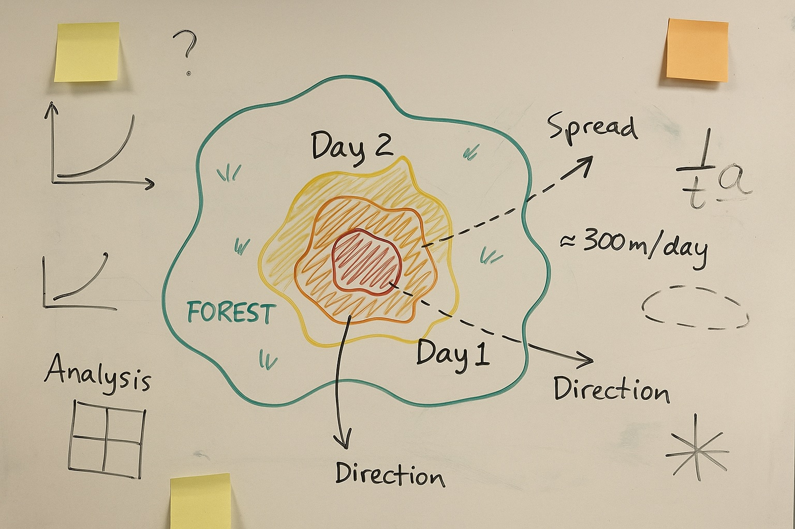
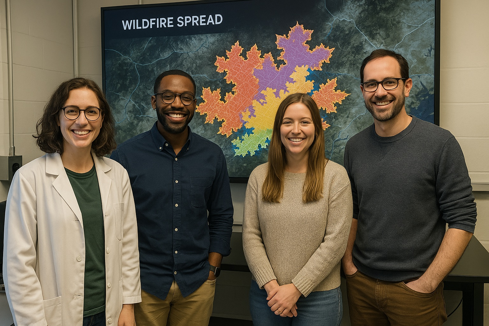

# Policy, Law, and Indigenous Sacred Sites Innovation Summit 2025

<a href="https://github.com/CU-ESIIL/policy-law-indigenous-sacred-sites-innovation-summit-2025__7/edit/main/docs/index.md" title="Edit this page">✏️</a>

<!-- =========================================================
HERO (Swap hero.jpg, title, strapline, and the three links)
========================================================= -->

[Raw photo location: hero.jpg](https://github.com/CU-ESIIL/policy-law-indigenous-sacred-sites-innovation-summit-2025__7/blob/main/docs/assets/hero.jpg)

**One sentence on impact:** In three days we pair legal expertise with Indigenous-led stewardship priorities to surface actionable guidance for safeguarding sacred sites.

**[Project brief (PDF)](assets/Seven%20ways%20to%20measure%20fire%20polygon%20velocity-4.pdf) · [View shared code](https://github.com/CU-ESIIL/policy-law-indigenous-sacred-sites-innovation-summit-2025__7/blob/main/code/fired_time_hull_panel.ipynb) · [Explore data](https://github.com/CU-ESIIL/policy-law-indigenous-sacred-sites-innovation-summit-2025__7/blob/main/code/prism_quicklook.py)**

> **About this site:** This is a public, in-progress record of the Policy, Law, and Indigenous Sacred Sites Innovation Summit 2025 sprint (Group 7). Edit everything here in your browser: open a file → pencil icon → Commit changes.

---

## How to use this page (for the team)
- **Edit this file:** `docs/index.md` → ✎ → change text → **Commit changes**.
- **Add images:** upload to `docs/assets/` and reference like `assets/your_file.png`.
- Keep **text short** and **visuals first**. Think “slide captions,” not essays.

---

## Day 1 — Define & Explore
*Focus: clarify goals, co-create guiding questions, document shared context.*

### Our product 📣
- Develop a policy roadmap highlighting immediate actions agencies and Tribes can take to protect sacred sites.
- Prototype a story-driven data visualization that situates sacred landscapes within existing legal frameworks.

### Our question(s) 📣
- Which policy levers and legal tools most effectively uphold Indigenous sovereignty for sacred lands?
- Where do gaps in law or data leave culturally important places vulnerable?
- How do we package recommendations so decision-makers can act quickly and responsibly?

### Hypotheses / intentions 📣
- We think aligning federal, state, and Tribal protections will reveal practical pathways to safeguard sacred landscapes.
- We intend to test whether publicly available geospatial layers and case studies can anchor co-produced policy recommendations.
- We will know we’re onto something if partners see a clear sequence of shared actions and information needs.

### Why this matters (the “upshot”) 📣
Protecting Indigenous sacred sites requires centering community-led priorities, honoring sovereignty, and coordinating legal mechanisms across jurisdictions. A concise set of co-created recommendations gives policy makers and practitioners a clear mandate for collaboration.

### Inspirations (papers, datasets, tools)
- Publication: Add key legal or governance analyses that frame sacred site protection.
- Dataset portal: Link to spatial layers (Tribal lands, heritage registries, conservation designations) that inform your synthesis.
- Tool/tech: Track any methods for collaborative mapping, policy comparison, or decision support you adopt.

### Field notes / visuals

[Raw photo location: day1_whiteboard.jpg](https://github.com/CU-ESIIL/policy-law-indigenous-sacred-sites-innovation-summit-2025__7/blob/main/docs/assets/day1_whiteboard.jpg)
*Caption: Snapshot of shared priorities, legal frameworks, or storytelling ideas surfaced on Day 1.*

> **Different perspectives:** Capture complementary or contrasting viewpoints—they sharpen your final recommendations.

---

## Day 2 — Data & Methods
*Focus: gather evidence, test tools, and capture the visuals that communicate your story.*

### Data sources we’re exploring 📣
- **Sacred sites or cultural resource registries** — Document access instructions, licensing constraints, and relevant attributes.
  
  [Raw photo location: explore_data_plot.png](https://github.com/CU-ESIIL/policy-law-indigenous-sacred-sites-innovation-summit-2025__7/blob/main/docs/assets/explore_data_plot.png)
  *Snapshot showing patterns that influence policy recommendations (e.g., overlap with management jurisdictions).* 
- **Policy or treaty archives** — Note repositories that track case law, federal notices, or Tribal agreements that shape protections.

### Methods / technologies we’re testing 📣
- Comparative policy review and legal mapping of protections across jurisdictions.
- Geospatial overlays that pair sacred site extents with land status, threat indicators, or stewardship capacity.
- Story map, dashboard, or PDF layout tools for communicating co-produced recommendations.

### Challenges identified
- Incomplete or sensitive datasets that require additional permissions.
- Conflicting definitions of “sacred site” across agencies and statutes.
- Time needed to validate interpretations with Indigenous knowledge holders.

### Visuals
#### Static figure

[Raw photo location: figure1.png](https://github.com/CU-ESIIL/policy-law-indigenous-sacred-sites-innovation-summit-2025__7/blob/main/docs/assets/figure1.png)
*Figure 1.* Illustrate a key relationship (e.g., sites lacking formal protection within a region of interest).

#### Animated change (GIF)

[Raw photo location: change.gif](https://github.com/CU-ESIIL/policy-law-indigenous-sacred-sites-innovation-summit-2025__7/blob/main/docs/assets/change.gif)
*Figure 2.* Highlight evolving policy milestones, stewardship activities, or threats through time.

#### Interactive map (iframe)
<iframe
  title="Study area (OpenStreetMap)"
  src="https://www.openstreetmap.org/export/embed.html?bbox=-105.35%2C39.90%2C-105.10%2C40.10&layer=mapnik&marker=40.000%2C-105.225"
  width="100%" height="360" frameborder="0"></iframe>

<a href="https://www.openstreetmap.org/?mlat=40.000&mlon=-105.225#map=12/40.0000/-105.2250">Open full map</a>

> If an embed doesn’t load, put the normal link directly under it.

---

## Final Share Out — Insights & Sharing
*Focus: synthesize findings, share co-produced recommendations, and celebrate partnerships.*

[Raw photo location: team_photo.jpg](https://github.com/CU-ESIIL/policy-law-indigenous-sacred-sites-innovation-summit-2025__7/blob/main/docs/assets/team_photo.jpg)

### Findings at a glance 📣
- Headline 1 — What legal or policy opportunity emerged?
- Headline 2 — Which gaps or risks require urgent attention?
- Headline 3 — What collaborative pathway or agreement should stakeholders pursue next?

### Visuals that tell the story 📣

[Raw photo location: fire_hull.png](https://github.com/CU-ESIIL/policy-law-indigenous-sacred-sites-innovation-summit-2025__7/blob/main/docs/assets/fire_hull.png)
*Visual 1.* Swap in the primary graphic that synthesizes policy, law, and Indigenous stewardship insights.

[Raw photo location: hull_panels.png](https://github.com/CU-ESIIL/policy-law-indigenous-sacred-sites-innovation-summit-2025__7/blob/main/docs/assets/hull_panels.png)
*Visual 2.* Provide supporting evidence, such as jurisdiction overlays or stakeholder feedback.

[Raw photo location: main_result.png](https://github.com/CU-ESIIL/policy-law-indigenous-sacred-sites-innovation-summit-2025__7/blob/main/docs/assets/main_result.png)
*Visual 3.* Add an additional figure that captures remaining questions or next steps.

<iframe
  title="Short explainer video (optional)"
  width="100%" height="360"
  src="https://www.youtube.com/embed/ASTGFZ0d6Ps"
  frameborder="0" allow="accelerometer; autoplay; clipboard-write; encrypted-media; gyroscope; picture-in-picture; web-share"
  allowfullscreen></iframe>

### What’s next? 📣
- Immediate follow-ups the team or partners will pursue.
- What you would expand with one more week or month of collaboration.
- Who needs to see this work next (agencies, Tribal councils, community leaders).

---

## Featured links (image buttons)
<table>
<tr>
<td align="center" width="33%">
  <a href="assets/Seven%20ways%20to%20measure%20fire%20polygon%20velocity-4.pdf"> <strong>Read the brief</strong></a>
</td>
<td align="center" width="33%">
  <a href="https://github.com/CU-ESIIL/policy-law-indigenous-sacred-sites-innovation-summit-2025__7/blob/main/code/fired_time_hull_panel.ipynb"> <strong>View code</strong></a>
</td>
<td align="center" width="33%">
  <a href="https://github.com/CU-ESIIL/policy-law-indigenous-sacred-sites-innovation-summit-2025__7/blob/main/code/prism_quicklook.py"> <strong>Explore data</strong></a>
</td>
</tr>
</table>

---

## Team
| Name | Role | Contact | GitHub |
|------|------|---------|--------|
| _Add team member_ | Lead (policy coordination) | name@example.org | @github-handle |
| _Add team member_ | Legal research | name@example.org | @github-handle |
| _Add team member_ | Data & visualization | name@example.org | @github-handle |
| _Add team member_ | Indigenous partnerships | name@example.org | @github-handle |

---

## Storage

**Code**
Keep shared scripts, notebooks, and utilities in the [`code/`](https://github.com/CU-ESIIL/policy-law-indigenous-sacred-sites-innovation-summit-2025__7/tree/main/code) directory. Document how to run them in a README or within the files so teammates and visitors can reproduce your workflow.

**Documentation**
Use the [`docs/`](https://github.com/CU-ESIIL/policy-law-indigenous-sacred-sites-innovation-summit-2025__7/tree/main/docs) folder to publish project updates on this site. Longer internal notes can live in [`documentation/`](https://github.com/CU-ESIIL/policy-law-indigenous-sacred-sites-innovation-summit-2025__7/tree/main/documentation); summarize key takeaways here so the public story stays current.

---

## Cite & reuse
If you use these materials, please cite:

> Policy, Law, and Indigenous Sacred Sites Innovation Summit 2025 Team. (2025). *Policy, Law, and Indigenous Sacred Sites Innovation Summit 2025 — Group 7 outputs*. https://github.com/CU-ESIIL/policy-law-indigenous-sacred-sites-innovation-summit-2025__7

License: CC-BY-4.0 unless noted. See dataset licenses on the **[Data](data.md)** page.

---

<!-- Upload images to docs/assets/ and reference as assets/filename.png. Keep images ~1200 px wide; avoid >5–8 MB per file. Update this page at least once per day during the sprint. -->
